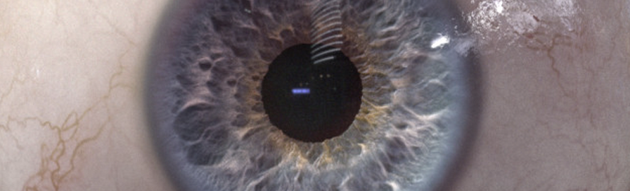

# Eye
Rodrigo Núñez Portfolio @ MiT | xPRO

### Descripción del proyecto.
En este proyecto se muestran un par de ojos que siguen el movimiento del mouse a través de la pantalla. 
#### Aprendizaje: 

  <ol>
    <li>Eventos en JavaScript</li>
    <li>Manipulación de elementos en DOM</li>
  </ol>

### Cómo ejecutar el proyecto: 

Descargar los archivos del repositorio en una misma carpeta y abrir el archivo TwoEyes.html en un navegador para ver su funcionamiento.

### Road Map

No se tiene pensado ninguna mejora.

### Licencia:

<a href="LICENSE">LICENSE</a>